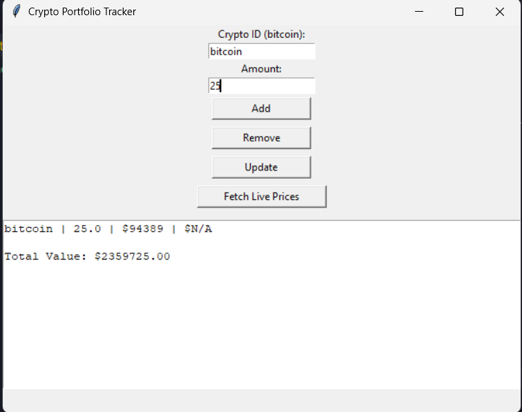

# 🪙 Crypto Portfolio Tracker (Python + Tkinter)

A desktop-based cryptocurrency portfolio tracking application built using Python and Tkinter, integrated with the CoinGecko Live API to fetch real-time market prices and calculate total portfolio value dynamically.

---

## 📌 Project Overview

Managing multiple cryptocurrency investments manually can be complex and error-prone. This project provides a simple, lightweight desktop solution that allows users to track cryptocurrency holdings, fetch real-time prices, and calculate total portfolio value using a graphical user interface.

This application is ideal for students, beginners, and small investors who want a fast and easy way to monitor crypto assets.

---

## 🎯 Objectives

- Develop a GUI-based crypto portfolio management system  
- Integrate real-time price data using a public API  
- Calculate live portfolio value automatically  
- Provide a beginner-friendly finance tracking tool  
- Demonstrate Python OOP, API handling, and GUI development  

---

## 🛠️ Technologies Used

- Python 3  
- Tkinter (GUI)  
- CoinGecko REST API  
- Requests Library  
- JSON  
- Object-Oriented Programming (OOP)  

---

## ✨ Features

- Add Cryptocurrency  
- Remove Cryptocurrency  
- Update Coin Amount  
- Fetch Live Market Prices  
- Automatic Total Portfolio Calculation  
- Desktop-Based Graphical Interface  
- Real-Time Data Using API  

---

## 🧑‍💻 System Architecture

User → Tkinter GUI → Python Backend (OOP) → CoinGecko API


---

## ⚙️ Installation & Setup

1. Clone the Repository

```bash
git clone https://github.com/your-username/crypto-portfolio-tracker.git
cd crypto-portfolio-tracker
```

2. Install Dependencies
```bash
pip install requests
```

3. Run the Application
```bash
python crypto_portfolio_gui.py
```

## 🔄 How the Project Works

1. User enters cryptocurrency ID (e.g., bitcoin) and amount

2. Data is stored in memory using Python lists and dictionaries

3. Application calls the CoinGecko API

4. Live USD prices are fetched in JSON format

5. Portfolio value is calculated using:
```bash
Total Value = Quantity × Live Price
```
6. Results are displayed in the Tkinter GUI instantly




## ✅ Supported Crypto IDs (Examples)

| Crypto    | ID        |
|-----------|-----------|
| Bitcoin   | `bitcoin` |
| Ethereum  | `ethereum`|
| Dogecoin  | `dogecoin`|
| Ripple    | `ripple`  |
| Solana    | `solana`  |


## 👨‍🎓 Author

Sameer Yadav `\n`
B.Tech Computer Science


